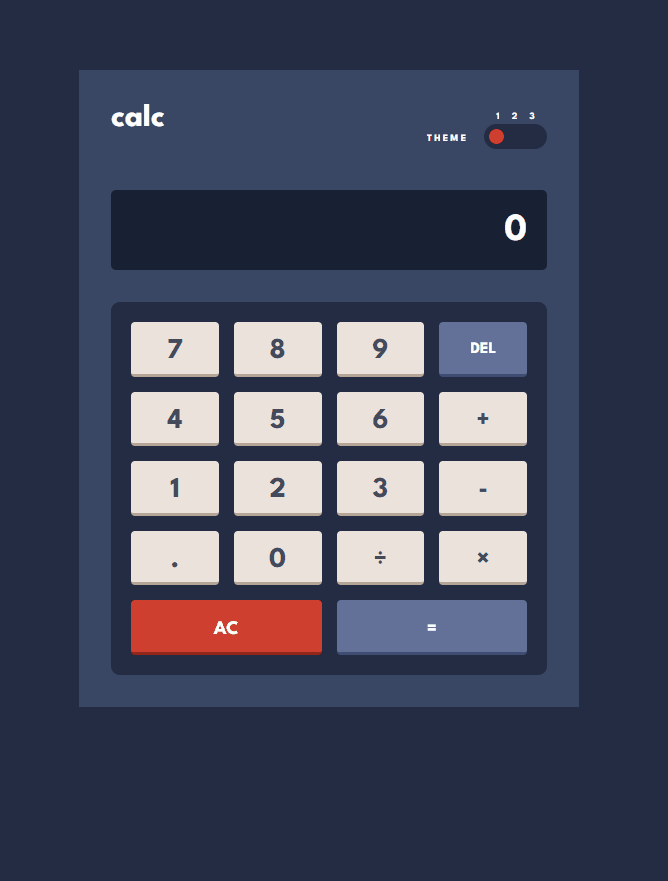

# Frontend Mentor - Calculator app solution

This is a solution to the [Calculator app challenge on Frontend Mentor](https://www.frontendmentor.io/challenges/calculator-app-9lteq5N29). Frontend Mentor challenges help you improve your coding skills by building realistic projects. 

## Table of contents

- [Frontend Mentor - Calculator app solution](#frontend-mentor---calculator-app-solution)
  - [Table of contents](#table-of-contents)
  - [Overview](#overview)
    - [The challenge](#the-challenge)
    - [Screenshot](#screenshot)
  - [My process](#my-process)
    - [Built with](#built-with)
    - [What I learned](#what-i-learned)
    - [Continued development](#continued-development)
    - [Useful resources](#useful-resources)
  - [Author](#author)

## Overview

### The challenge

Users should be able to:

- See the size of the elements adjust based on their device's screen size
- Perform mathmatical operations like addition, subtraction, multiplication, and division
- Adjust the color theme based on their preference

### Screenshot




## My process

### Built with

- Semantic HTML5 markup
- CSS custom properties
- Flexbox
- CSS Grid
- [Sass](https://sass-lang.com/) - Sass CSS preprocessor
- Mobile-first workflow

### What I learned

I learned a ton with this project. Especially learning about Sass, which I'm glad I
took the extra time to do so because it vastly improved the architecture of the
project and made things more manageable. I learned about an architecture style 
using Sass that separated the partials using many different scss files. This 
helped me focus on what I was doing. One thing I'm proud of is how I used mixins
and Sass loops to generate the different themes in CSS, but needing to do so by
defining CSS variables. Checkout _themes.scss for how I did this. When all said 
and done with this idea, it was as simple as:

```scss
$themes: theme-one, theme-two, theme-three;
@each $theme in $themes {
    html[data-theme=#{$theme}] {
        @if $theme == theme-one {
            @include themes.theme-background(themes.$t1-main-bg, themes.$t1-toggle-bg, themes.$t1-screen-bg); 
            @include themes.theme-keys(themes.$t1-key-bg-a, themes.$t1-key-shadow-a, 
                                    themes.$t1-key-bg-toggle, themes.$t1-key-shadow-b, 
                                    themes.$t1-key-bg-b, themes.$t1-key-shadow-c);
            @include themes.theme-text(themes.$t1-text-highlights, themes.$t1-text-dark);
        } @else if $theme == theme-two {
            @include themes.theme-background(themes.$t2-main-bg, themes.$t2-toggle-bg, themes.$t2-screen-bg); 
            @include themes.theme-keys(themes.$t2-key-bg-a, themes.$t2-key-shadow-a, 
                                    themes.$t2-key-bg-toggle, themes.$t2-key-shadow-b, 
                                    themes.$t2-key-bg-b, themes.$t2-key-shadow-c);
            @include themes.theme-text(themes.$t2-text-highlights, themes.$t2-text-dark);
        } @else if $theme == theme-three {
            @include themes.theme-background(themes.$t3-main-bg, themes.$t3-toggle-bg, themes.$t3-screen-bg); 
            @include themes.theme-keys(themes.$t3-key-bg-a, themes.$t3-key-shadow-a, 
                                    themes.$t3-key-bg-toggle, themes.$t3-key-shadow-b, 
                                    themes.$t3-key-bg-b, themes.$t3-key-shadow-c);
            @include themes.theme-text(themes.$t3-text-highlights, themes.$t3-text-dark);
            --extra-white-text: #{themes.$t3-extra-white-text};
        }
    }
}
```

in order to create the various themes.

Secondly, I learned a lot about JavaScript and learned a clever trick using 
regular expressions. Because JavaScript does not allow lookbehinds, I found a
nice hack on how to still get away with inserting commas every 3 places in a 
number, but also needing to exclude them from the right-hand side of a decimal
point. Here's a snippet from `calculator.js`:

```js
// insert new commas
const regexOne = /(^|[^0-9.])([0-9]{4,})/g; // selects part before decimal
const regexTwo = /[0-9](?=(?:[0-9]{3})+(?![0-9]))/g; // selects every 3rd num

// ensures only part before decimal is comma delimited
screen.value = screen.value.replace(regexOne, ($0, $1, $2) => {
    return $1 + $2.replace(regexTwo, '$&,');
})
```

I also needed to figure out how to dynamically scale the size of the `<input>`
text depending on the current width of its container. This required me to 
figure out a way to measure the widths of characters. It hurts performance a bit,
and feels a bit tacky, but it works for the most part.

### Continued development

I'd like to create an `eval()` independent solution for this. I just didn't have time
to implement a parser and tokenize everything. But I think that would be a fun project
to do later on. I'd also like to refactor my dynamic resizing solution for the screen text.

### Useful resources

- [Regular Expressons Cookbook](https://smile.amazon.com/Regular-Expressions-Cookbook-Solutions-Programming/dp/1449319432/?_encoding=UTF8&pd_rd_w=IxntT&content-id=amzn1.sym.e4bd6ac6-9035-4a04-92a6-fc4ad60e09ad&pf_rd_p=e4bd6ac6-9035-4a04-92a6-fc4ad60e09ad&pf_rd_r=VH3B9G6418F56183WAKH&pd_rd_wg=lHkR2&pd_rd_r=99baf17a-7075-4ed4-a4b1-ab244424c6af&ref_=pd_gw_ci_mcx_mr_hp_atf_m) - This helped me tremendously when figuring out the comma insertion problem.
- [3-Way Toggle Switch](https://webcodespace.com/how-to-create-a-three-state-toggle-switch-using-html-css-and-javascript/) - This helped me 
implement the 3-way toggle switch for theme selection.
- [Making Multiple Themes](https://lukelowrey.com/css-variable-theme-switcher/) - This helped my
approach with how to make multiple themes using CSS.
- [Using Grid to Make a Calculator](https://freshman.tech/css-grid-calculator/) - This helped me
refactor my HTML to better make the calculator.
- [Regex Tester](https://regex101.com/) - This was indespensible when experimenting with regex patterns.
- [Sass Architecture](https://itnext.io/structuring-your-sass-projects-c8d41fa55ed4) - This helped me 
organize my Sass better.


## Author

- Website - [Aaron Gomez](http://ohof.one)
- Frontend Mentor - [@a13g24](https://www.frontendmentor.io/profile/a13g24)